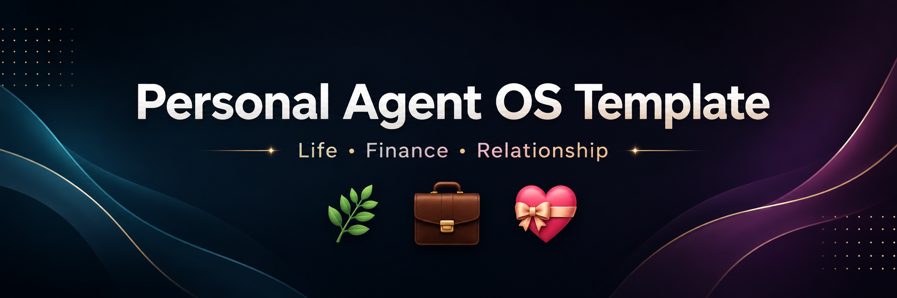

# Personal Agent OS Template



Build your own AI-powered personal operating system for life, finances, and relationships.


> ### 👋 New here? Start with the **[Step-by-Step Walkthrough](./docs/WALKTHROUGH.md)**
> It covers everything in plain language — installing tools, getting your copy,
> and running your first check-in. No experience needed.

**Works with your choice of AI assistant:** GitHub Copilot CLI, Claude Code, or
Gemini CLI. You only need one.

## Why this exists
Most people do not need more goals. They need better systems.  
This template helps you launch practical AI agents with clear roles, rhythms, and boundaries.

## What this is
This is a **starter template** for setting up:
1. A Life Agent (planning, tasks, execution)
2. A Finance Agent (cash flow, bills, budget rhythm)
3. A Relationship Agent (communication and reflection support)

## What it can help with
- Reduce mental load
- Keep context between sessions
- Run weekly check-ins consistently
- Turn recurring responsibilities into repeatable workflows
- Improve follow-through and decision clarity

## Who this is for
- Busy parents and professionals
- People overwhelmed by planning and context-switching
- Couples wanting clearer planning rhythm
- Anyone who wants AI to support real-life execution

## Quick start
> First time? Use the **[Step-by-Step Walkthrough](./docs/WALKTHROUGH.md)** instead.

1. Read [docs/REQUIREMENTS.md](./docs/REQUIREMENTS.md)
2. Read [START-HERE.md](./START-HERE.md)
3. Complete [SETUP-CHECKLIST.md](./SETUP-CHECKLIST.md)
4. Run the setup helper to generate your working files:
   - Windows: `./scripts/setup.ps1`
   - macOS/Linux: `bash scripts/setup.sh`
5. Replace every `{{PLACEHOLDER}}` (see [docs/PLACEHOLDERS.md](./docs/PLACEHOLDERS.md))
6. (Optional) Set up [launch aliases](./docs/ALIASES.md)
7. Start your first check-in cycle

## Repository structure
```text
docs/        walkthrough, requirements, placeholder glossary, aliases
templates/   fill-in templates with placeholders
scripts/     setup helpers (setup.ps1 / setup.sh)
examples/    a filled-out reference setup
assets/      banner image
.github/     Copilot instructions and issue templates
CLAUDE.md    instructions for Claude Code
GEMINI.md    instructions for Gemini CLI
```

## What's included
This template is ready to use out of the box:
- ✅ Beginner [step-by-step walkthrough](./docs/WALKTHROUGH.md)
- ✅ Works with **Copilot, Claude Code, or Gemini** (matching instruction files)
- ✅ Fill-in templates for all working files (`templates/`)
- ✅ One-command setup helper for Windows & macOS/Linux (`scripts/`)
- ✅ A filled-out example to copy from (`examples/`)
- ✅ Placeholder glossary and optional launch aliases (`docs/`)
- ✅ Agent instructions with cross-session context memory
- ✅ Safety-first `.gitignore` that keeps your personal data local

Everything is a starting point — rename agents, change the cadence, add modes,
and adapt it to your life.

## How context persists between sessions
Your agent stays useful over time by reading two files at the start of every
session and updating them at the end:
- `CURRENT_CONTEXT.md` — what's live right now (priorities, open tasks)
- `SESSION_LOG.md` — a running history of check-ins and decisions

These are generated from `templates/` and kept **local** (git-ignored), so your
personal data never leaves your machine. See [`examples/`](./examples) for what
they look like filled out.

## Important disclaimer
This template is provided **as-is** for educational and organizational purposes.  
You are responsible for reviewing, testing, and safely applying changes in your own environment.  
No warranties or guarantees are provided. Use at your own risk.

This is not legal, financial, medical, or licensed therapeutic advice.
