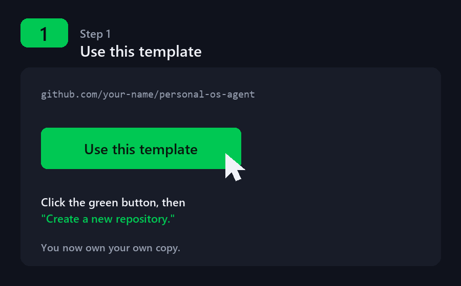
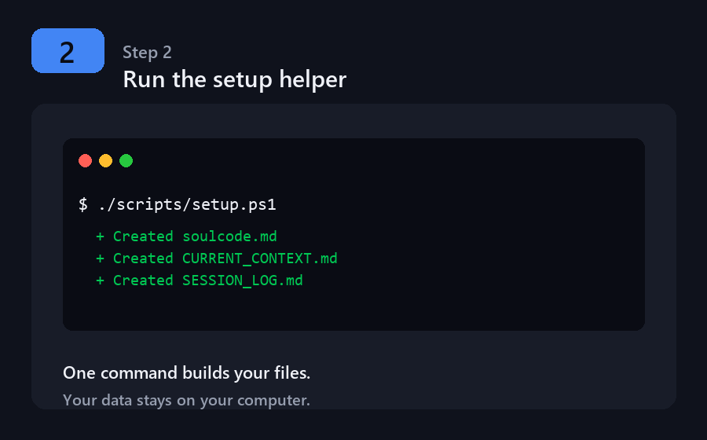
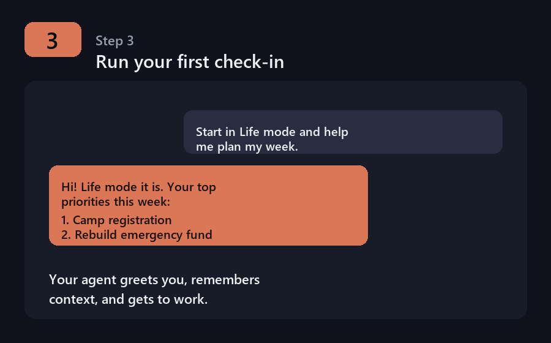

# Step-by-Step Walkthrough (Beginner Friendly)

New to this? Follow along top to bottom. No prior experience needed. Total time:
about 20–30 minutes.

This template works with **any** of these AI assistants — pick the one you have:
- **GitHub Copilot CLI** (`copilot`)
- **Claude Code** (`claude`)
- **Gemini CLI** (`gemini`)

You only need **one**. Wherever you see all three commands below, just use yours.

---

## The whole flow in 3 pictures

| 1. Use this template | 2. Run the setup helper | 3. First check-in |
|:---:|:---:|:---:|
|  |  |  |
| Get your own copy on GitHub | One command creates your files | Your agent remembers and helps |

> The detailed steps below walk through each of these (plus installing the tools).

---

## Step 1 — Open a terminal

A "terminal" is a text window where you type commands.

- **Windows:** Press `Start`, type **PowerShell**, open *Windows PowerShell*.
- **macOS:** Press `Cmd + Space`, type **Terminal**, press Enter.
- **Linux:** Open your **Terminal** app.

You'll type the rest of the commands here, pressing Enter after each one.

---

## Step 2 — Install Git

Git lets you copy this template to your computer.

- **Windows:** Download from <https://git-scm.com/download/win> and run the installer (accept the defaults).
- **macOS:** Type `git --version` and press Enter — if it's missing, macOS offers to install it.
- **Linux:** `sudo apt install git` (Debian/Ubuntu) or your distro's package manager.

Check it worked:
```bash
git --version
```
You should see a version number.

---

## Step 3 — Install your AI assistant

Pick **one**. Each needs Node.js first for the npm installs — get it from
<https://nodejs.org> (choose the "LTS" version) if you don't have it.

**Option A — GitHub Copilot CLI**
```bash
npm install -g @github/copilot
```
Then sign in: run `copilot` and follow the login prompt. (Requires a GitHub
account with Copilot enabled — Free or Pro.)

**Option B — Claude Code**
```bash
npm install -g @anthropic-ai/claude-code
```
Then run `claude` and follow the sign-in prompt. (Requires a Claude account.)

**Option C — Gemini CLI**
```bash
npm install -g @google/gemini-cli
```
Then run `gemini` and choose *Sign in with Google*. (Free tier available.)

Check it worked (use your tool):
```bash
copilot --version    # or:  claude --version    # or:  gemini --version
```

---

## Step 4 — Get your own copy of the template

1. Go to the template page: <https://github.com/jacqle331/personal-os-agent>
2. Click the green **Use this template** button → **Create a new repository**.
3. Give it a name (e.g. `my-personal-os`) and create it.
4. Copy it to your computer — replace `YOUR-USERNAME` with your GitHub username:
   ```bash
   git clone https://github.com/YOUR-USERNAME/my-personal-os.git
   cd my-personal-os
   ```

You're now "inside" your project folder.

---

## Step 5 — Generate your working files

This copies the blank templates into real files you'll personalize.

- **Windows (PowerShell):**
  ```powershell
  ./scripts/setup.ps1
  ```
- **macOS / Linux:**
  ```bash
  bash scripts/setup.sh
  ```

You should see "Created" next to several `.md` files. These are git-ignored, so
your personal information stays on your computer and is never uploaded.

---

## Step 6 — Personalize it

Open the new files in any text editor (Notepad, TextEdit, or VS Code) and replace
every `{{PLACEHOLDER}}` with your own details:

- `intake-form.md` — your name, agents, cadence
- `soulcode.md` — your values and how you want the agent to talk to you
- `AGENT_REGISTRY.md` — your three agents
- `CURRENT_CONTEXT.md` — what's going on this week
- `SESSION_LOG.md` — leave blank for now; it fills up as you go

Not sure what a placeholder means? See **[PLACEHOLDERS.md](./PLACEHOLDERS.md)** for
every one with examples. Want to see a finished version? Look in
**[`../examples/`](../examples)**.

---

## Step 7 — Start your first check-in

Make sure you're in your project folder, then start your assistant:

```bash
copilot      # or:  claude      # or:  gemini
```

Then type something like:

> Start in Life mode. Read my CURRENT_CONTEXT.md and SESSION_LOG.md, then help me plan my week.

The agent will greet you, confirm the mode, and walk you through it. At the end,
let it update `CURRENT_CONTEXT.md` and add a `SESSION_LOG.md` entry — that's how it
remembers things next time.

---

## Step 8 — Build the habit

Run a check-in on your chosen days:
- **Life** — weekly planning
- **Finance** — twice a month
- **Relationship** — weekly or as needed

Want one-word shortcuts (type `life` instead of the full command)? See
**[ALIASES.md](./ALIASES.md)**.

---

## Troubleshooting

| Problem | Fix |
|---------|-----|
| `command not found` | The tool isn't installed or the terminal needs restarting. Re-run Step 3, then close and reopen the terminal. |
| `git: command not found` | Redo Step 2. |
| Script "cannot be loaded" on Windows | Run `Set-ExecutionPolicy -Scope Process -ExecutionPolicy Bypass` then re-run the script. |
| Agent doesn't remember anything | Make sure you ran Step 5 and that `CURRENT_CONTEXT.md` / `SESSION_LOG.md` exist in the folder. |
| Don't want to use a script | You can manually copy each file in `templates/` and remove `.template` from the name. |

---

## Safety reminder
Never paste bank exports, account numbers, or SSNs into these files. Keep
sensitive details high-level. See [`../SECURITY-PRIVACY.md`](../SECURITY-PRIVACY.md).
